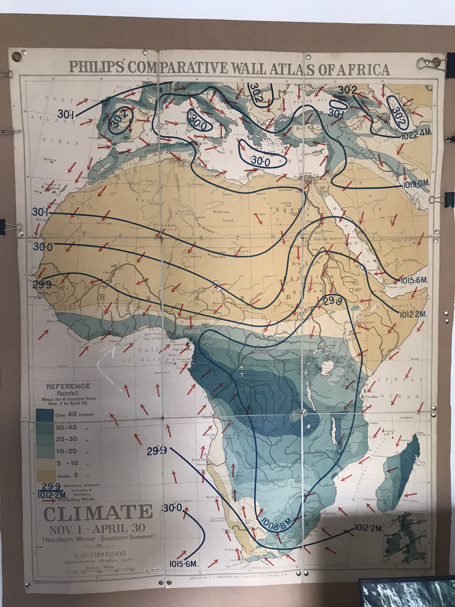
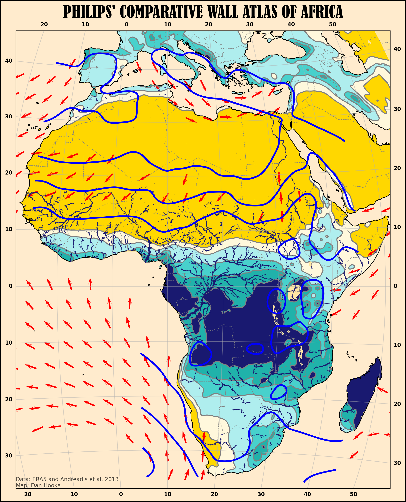

# africa_wall_atlas

Updating a project from November 2022, recreating a meteorological atlas of Africa from the 1950s using *Matplotlib, Cartopy, Xarray, GeoPandas* and *cdsapi* with data from [ERA5](https://cds.climate.copernicus.eu/cdsapp#!/dataset/reanalysis-era5-single-levels?tab=overview), [Andreadis et al. 2013](https://agupubs.onlinelibrary.wiley.com/doi/abs/10.1002/wrcr.20440) and Natural Earth. 

See [wall_atlas_of_africa.ipynb](wall_atlas_of_africa.ipynb) for the full workflow.

Still a WIP.

**Original version** and **recreated version.**

